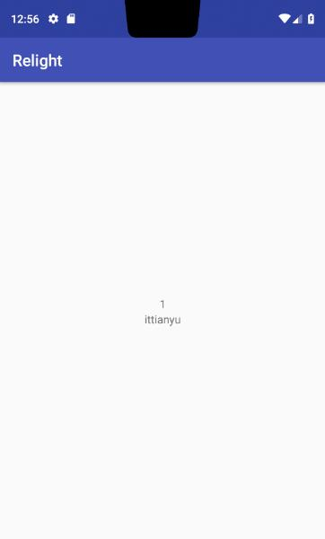

## 目的 ##
目的：学习 RelativeWidget 的简单用法。

## 内容 ##
往 RelativeWidget 中加入 2 个 TextWidget。

## 简介 ##
RelativeWidget 是对 RelativeLayout 的封装。 用于包容其他 Widget。

## 效果 ##
在中间显示 id 和 name。
点击屏幕后，触发刷新数据。




## 准备 ##

复制入门教程3的中2个类 `WidgetActivity` 和 `StatefulUserWidget`

#### ids ####

由于 Relative 需要 id 来表示相对关系。
而这个 id 可以我们手动生成，也可以由开发工具来生成，一般的，我们都是让开发工具来生成，这样保证了id值不会重复。
所以在 values 文件夹中新建 ids.xml

```
<?xml version="1.0" encoding="utf-8"?>
<resources>
    <item name="tw_id" type="id"/>
    <item name="tw_name" type="id"/>
</resources>
```

## StatefulUserWidget ##

将泛型换成 Relative
```
StatefulWidget<RelativeLayout, RelativeWidget>
```

#### createState ####

在上一节的基础，把 LinearWidget 改成 FrameWidget。
与之前不同的是， twId 使用了另一种方式来设置属性，重写 `initProps` 方法，并在里面设置属性。
对于 `RelativeWidget` 来说，需要传入的是 `WidgetAndProps` 来表示控件和位置关系。

需要特别注意的是，这里的相对位置和 xml 中的略有不同，假设选定一个控件为基准，其他控件相对于它的位置并不会对这个基准控件位置产生任何影响。

比如基准控件在最左边，另一个控件在它左边，则我们是看不到左边那个控件的，因为它跑到屏幕左边去了。


```
    private TextWidget twId;
    private TextWidget twName;

    @Override
    protected State<RelativeWidget> createState(Context context, Lifecycle lifecycle) {
        twId = new TextWidget(context, lifecycle) {
            @Override
            protected void initProps() {
                super.initProps();
                id = R.id.tw_id;
                textSize = dp(16);
                textColor = Color.BLACK;
            }
        };
        twName = new TextWidget(context, lifecycle);
        twName.id(R.id.tw_name);
        RelativeWidget root = new RelativeWidget(context, lifecycle,
                new WidgetAndProps(twId, new Prop(RelativeLayout.CENTER_IN_PARENT, Prop.TRUE)),
                new WidgetAndProps(twName, new Prop(RelativeLayout.BELOW, R.id.tw_id),
                        new Prop(RelativeLayout.CENTER_HORIZONTAL, Prop.TRUE))
        );
        return StateUtils.create(root);
    }
```

#### relativeRule 2 ####

上面的那种方式似乎有点繁琐，热心的 [贵州穿青人](https://github.com/liyujiang-gzu) 提出了一个更好的方案，于是，你可以写成这样。 当然，如果外面套的不是 RelativeLayout，这设置并不会起作用。

```
        RelativeWidget root = new RelativeWidget(context, lifecycle,
            twId.addRule(RelativeLayout.CENTER_IN_PARENT, Prop.TRUE),
            twName.addRule(RelativeLayout.BELOW, R.id.tw_id)
                .addRule(RelativeLayout.CENTER_HORIZONTAL, Prop.TRUE)
        );
```


#### initWidget ####

和上一节类似
```
    @Override
    public void initWidget(RelativeWidget widget) {
        widget
                .matchParent()
                .onClickListener(v -> setState(() -> {
                    user = UserDataSource.getInstance().getUser();
                }));
		update();
    }
```

#### update ####

把 ui 和 data 关联起来。

```
    @Override
    public void update() {
        super.update();
        twId.text(user.getId() + "");
        twName.text(user.getName());
    }
```

## 总结 ##

这里简单介绍了 RelativeWidget 的用法。用起来比较繁琐，没有在 xml 中使用那么方便，如果各位读者有什么建议，欢迎[到 github 上提](https://github.com/ittianyu/relight/issues/new)。

到这里为止，只介绍了另一种设置属性的办法，到这了，你应该对本库比较熟悉了。 后面将会介绍一些强大的用法。

