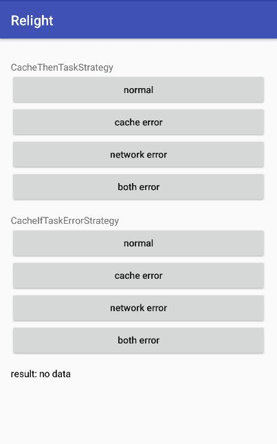

## 目的 ##
目的：学习缓存机制。

## 内容 ##
分别测试 `CacheThenTaskStrategy`、 `CacheIfTaskErrorStrategy` 在有网有缓存、有网无缓存、无网有缓存、无网无缓存情况下的调用顺序。

## 简介 ##
缓存是一个常见的需求，但是，不同应用的缓存需求不一样，并没有银弹能解决。 一般来说，节省开发成本不做缓存，或者缓存控制非常粗糙，直接通过网络层来做，这种缓存局限性很大，无法灵活控制，效果也不好。 但如果自己来控制缓存，则每个页面都要写一遍缓存的控制逻辑，重复代码多，逻辑混乱，不容易修改，开发体验极差。 而本框架帮你把缓存和网络之间逻辑统一封装起来，屏蔽调用过程，你只需要关注获取缓存和存储缓存即可。

## 效果 ##
在中间显示 id 和 name。
点击屏幕后，触发刷新数据，请求失败时自动重试，最多重试2次。



## 准备 ##
新建 `CacheWidget`，主要是一个 LinearLayout 里面 8 个 button 和 2 个 TextView，设置点击事件
复制上一篇的中1个类 `WidgetActivity`，并把 widget 换成 `CacheWidget`

```
public class CacheWidget extends StatefulWidget<LinearLayout, LinearWidget> implements View.OnClickListener {
    private TextWidget tvResult;
    private UserBean user;

    public CacheWidget(Context context, Lifecycle lifecycle) {
        super(context, lifecycle);
    }

    @Override
    protected State<LinearWidget> createState(Context context) {
        tvResult = new TextWidget(context, lifecycle);
        LinearWidget widget = new LinearWidget(context, lifecycle,
                new TextWidget(context, lifecycle).text("CacheThenTaskStrategy").marginTop(16.0f),
                new ButtonWidget(context, lifecycle).allCaps(false).text("normal").id(btnNormal1).onClickListener(this).widthMatchAndHeightWrap(),
                new ButtonWidget(context, lifecycle).allCaps(false).text("cache error").id(btnCacheError1).onClickListener(this).widthMatchAndHeightWrap(),
                new ButtonWidget(context, lifecycle).allCaps(false).text("network error").id(btnNetworkError1).onClickListener(this).widthMatchAndHeightWrap(),
                new ButtonWidget(context, lifecycle).allCaps(false).text("both error").id(btnBothError1).onClickListener(this).widthMatchAndHeightWrap(),

                new TextWidget(context, lifecycle).text("CacheIfTaskErrorStrategy").marginTop(16.0f),
                new ButtonWidget(context, lifecycle).allCaps(false).text("normal").id(btnNormal2).onClickListener(this).widthMatchAndHeightWrap(),
                new ButtonWidget(context, lifecycle).allCaps(false).text("cache error").id(btnCacheError2).onClickListener(this).widthMatchAndHeightWrap(),
                new ButtonWidget(context, lifecycle).allCaps(false).text("network error").id(btnNetworkError2).onClickListener(this).widthMatchAndHeightWrap(),
                new ButtonWidget(context, lifecycle).allCaps(false).text("both error").id(btnBothError2).onClickListener(this).widthMatchAndHeightWrap(),

                tvResult.textColor(Color.BLACK).marginTop(16.0f)
        );
        widget.orientation(LinearWidget.vertical)
                .matchParent()
                .padding(16.0f);
        return StateUtils.create(widget);
    }

    @Override
    public void onClick(View v) {

	}

    private String getUsername() {
        if (user == null) {
            return "no data";
        }
        return user.getName();
    }

    @Override
    public void update() {
        super.update();
        System.out.println("updateWidget: " + getUsername());
        tvResult.text("result: " + getUsername());
    }
}
```

## CacheWidget ##

#### task ####

因为需要模拟 网络、缓存和各自异常的情况。
这里先建 4 个 taks

```
    private Runnable networkTask = () -> {
        System.out.println("running network task...");
        user = UserDataSource.getInstance().getUserFromRemote();
        user.setName(user.getName() + "\tfrom network");
        System.out.println(user.getName());
    };

    private Runnable cacheTask = () -> {
        System.out.println("running cache task...");
        user = UserDataSource.getInstance().getUser();
        user.setName(user.getName() + "\tfrom cache");
        System.out.println(user.getName());
    };

    private Runnable networkErrorTask = () -> {
        System.out.println("running network task... error!");
        user = null;
        throw new RuntimeException("network error");
    };
    private Runnable cacheErrorTask = () -> {
        System.out.println("running cache task... error!");
        user = null;
        throw new RuntimeException("cache error");
    };
```

### onClick ###

发出请求是 onClick 触发的

```
    @Override
    public void onClick(View v) {
        switch (v.getId()) {
            case btnNormal1:
                setStateAsyncWithCache(cacheTask, networkTask);
                break;
            case btnCacheError1:
                setStateAsyncWithCache(cacheErrorTask, networkTask);
                break;
            case btnNetworkError1:
                setStateAsyncWithCache(cacheTask, networkErrorTask);
                break;
            case btnBothError1:
                setStateAsyncWithCache(cacheErrorTask, networkErrorTask);
                break;
            case btnNormal2:
                setStateAsyncWithCache(new CacheIfTaskErrorStrategy(), cacheTask, networkTask);
                break;
            case btnCacheError2:
                setStateAsyncWithCache(new CacheIfTaskErrorStrategy(), cacheErrorTask, networkTask);
                break;
            case btnNetworkError2:
                setStateAsyncWithCache(new CacheIfTaskErrorStrategy(), cacheTask, networkErrorTask);
                break;
            case btnBothError2:
                setStateAsyncWithCache(new CacheIfTaskErrorStrategy(), cacheErrorTask, networkErrorTask);
                break;
        }
    }
```

最主要的就是一个方法 `setStateAsyncWithCache`，分别传入 cacheTask 和 networkTask。
如果要自定义策略，可以调用从3个参数的重载方法，第一个参数传入一个策略，注意，这个策略不能共享，也就是每次都得 new 一个新的对象。

但是，这样每次都手动指定策略，比较麻烦，以后切换也很麻烦。 如果你全应用都是相同的策略，可以调用 `State.setDefaultCacheStrategy` 来修改默认的策略，传入你的策略 class。 之后你调用的任何 2 个参数的 `setStateAsyncWithCache` 都会采用你设置的这个默认策略。

然后观察 UI 或 日志，都能看到调用的先后顺序。

#### CacheStrategy ####

主要控制缓存和网络请求直接的调用关系。
默认提供了2种策略：
- CacheThenTaskStrategy：先获取缓存，后获取网络。如果缓存获取失败，不更新UI，网络任务执行完后，总是会去更新UI。
- CacheIfTaskErrorStrategy：先获取网络，当获取失败时，才去获取缓存。 无论网络还是缓存任务，执行完成后，都更新UI。

2 参数方法默认使用 CacheThenTaskStrategy。

除了可以使用库提供的策略，还可以自定义。
只要继承 CacheStrategy
重写里面的几个方法

- runCacheFirst：返回 true 表示先执行 cache
- shouldRunCacheTask：是否执行 cache task
- shouldUpdateViewAfterCacheTask：执行 cache task 之后是否更新UI
- shouldRunTask：是否执行 network task
- shouldUpdateViewAfterTask：执行 network task 之后是否更新UI

除了这几个方法，你还可以调用 `getCacheTaskError` `getTaskError` 来判断网络和缓存任务是否执行失败。

## 总结 ##

简单来说这一节就说了一个api `setStateAsyncWithCache`，如果本库提供的缓存类不能实现你的需求，可以自行实现一个。
