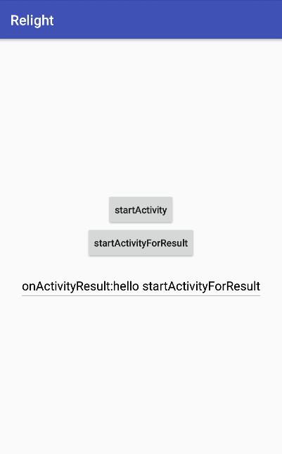

## 目的 ##
目的：学习 Widget 中 startActivity 的用法。

## 内容 ##
点击按钮 startActivity 打开一个 Activity 
点击按钮 startActivityForResult 打开一个 Activity，返回时收到回调和数据

## 简介 ##
startActivity 和 startActivityForResult 是非常常见的需求。 作为一个功能完善的框架，自然是要良好的支持。

## 效果 ##



## 准备 ##

新建 `StartActivityWidget` 继承 `StatelessWidget`
复制上一篇中1个类 `WidgetActivity`，并把 widget 换成 `StartActivityWidget`

## StartActivityWidget ##

先把简单的 UI 画好
```
public class StartActivityWidget extends StatelessWidget<LinearLayout, LinearWidget> {
    private EditWidget edtNote;
    private ButtonWidget btnStartActivity;
    private ButtonWidget btnStartActivityForResult;

    public StartActivityWidget(Context context, Lifecycle lifecycle) {
        super(context, lifecycle);
    }

    @Override
    protected LinearWidget build(Context context) {
        btnStartActivity = new ButtonWidget(context, lifecycle, "startActivity").allCaps(false);
        btnStartActivityForResult = new ButtonWidget(context, lifecycle, "startActivityForResult").allCaps(false);
        edtNote = new EditWidget(context, lifecycle)
                .textColor(Color.BLACK)
                .gravity(Gravity.CENTER)
                .enabled(false)
                .hintText("result here")
                .hintTextColor(0xFFCCCCCC);
        return new LinearWidget(context, lifecycle,
                btnStartActivity,
                btnStartActivityForResult,
                edtNote.marginTop(16.0f)
        );
    }

    @Override
    public void initWidget(LinearWidget widget) {
        widget
            .orientation(LinearWidget.vertical)
            .gravity(Gravity.CENTER)
            .matchParent();
    }
}
```

然后给两个 button 设置事件，然后发现和 activity 里面一样，可以直接调用 `startActivity`
```
    private static final int REQ = 1;
    public static final String RESULT_MSG = "msg";

    @Override
    public void initWidget(LinearWidget widget) {
        widget
            .orientation(LinearWidget.vertical)
            .gravity(Gravity.CENTER)
            .matchParent();

        btnStartActivity.onClickListener(v -> {
            startActivity(new Intent(context, WidgetActivity.class));
        });

        btnStartActivityForResult.onClickListener(v -> {
            startActivityForResult(new Intent(context, WidgetActivity.class), REQ);
        });

    }
```

习惯性的直接重写 `onActivityResult`，这个可以有
```
    @Override
    public void onActivityResult(int requestCode, int resultCode, @Nullable Intent data) {
        super.onActivityResult(requestCode, resultCode, data);
        System.out.println("onActivityResult, requestCode:" + requestCode + ", resultCode:" + resultCode + ", data:" + data);
        if (requestCode == REQ && resultCode == Activity.RESULT_OK && data != null) {
            edtNote.text("onActivityResult:" + data.getStringExtra(RESULT_MSG));
        }
    }
```

就在这时，可达鸭眉头一皱，发现事情并不简单。
视乎和 activity 没有任何绑定，这不科学。

是的，还有最有一步别漏了。 在 widget 所在的 activity 里绑定事件。

```
public class WidgetActivity extends AppCompatActivity {
    @Override
    protected void onCreate(Bundle savedInstanceState) {
        super.onCreate(savedInstanceState);
        View root = WidgetUtils.render(this, StartActivityWidget.class);
        setContentView(root);

        Intent intent = new Intent();
        intent.putExtra(StartActivityWidget.RESULT_MSG, "hello startActivityForResult");
        setResult(RESULT_OK, intent);
    }

    @Override
    protected void onActivityResult(int requestCode, int resultCode, @Nullable Intent data) {
        super.onActivityResult(requestCode, resultCode, data);
        ActivityDelegationManager.onActivityResult(this, requestCode, resultCode, data);
    }
}
```

onCreate 里面的主要是设置 result，可以忽略。


## 总结 ##

有人会问，如果是在 fragment 里面调用的呢？
fragment 也是在 activity 里显示的。所以，你懂得，并不需要多此一举来支持 fragment，减少绑定的数量难道不是件好事？
