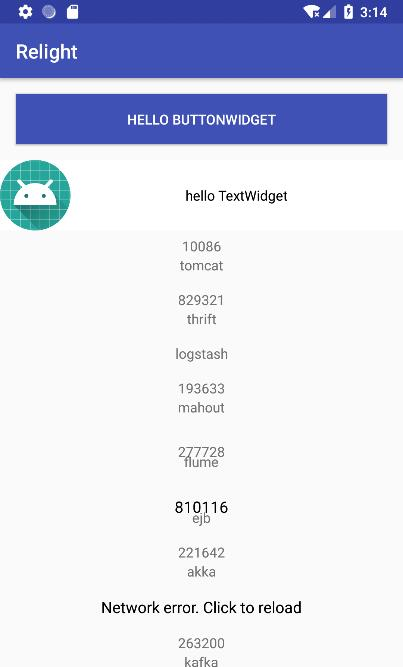

## 目的 ##
目的：了解 Widget xml 可视化支持

## 内容 ##
在 xml 中使用 widget

## 简介 ##
xml 可以实现实时预览，所以一般来说，都会用 xml 来绘制界面，所以为了迎合大部分开发者，本库也简单的适配了一下 xml。

## 效果 ##


## 准备 ##

新建一个 activity 和 layout

#### 确认初始化了 xml 功能 ####

因为 xml 支持采用了 json 和 反射，所以，在使用 xml 之前，你需要实现一个 `JsonConvertor`。
- What? 这么麻烦？
然而体贴的本框架早就考虑到了这一点，本着简单点的原则，本框架默认准备好了一个 `GsonConvertor`。
- What？我项目用的是 FastJson / Jackson，这样不就让我重复引入了两个同类型的库吗？
别慌，库里面仅仅是编译时依赖，也就是并不会把 gson 的库打包进去。
- 那该怎么用默认的 `GsonConvertor` ?
很简单，在你的主项目里加入 gson 的依赖 
`implementation 'com.google.code.gson:gson:2.8.5'`
- 怎么换成其他库支持的 `Convertor` ?
参考 `GsonConvertor` 编写一个类继承 `JsonConvertor`，然后启动时 或 使用 xml 之前初始化
`JsonConvertor.setInstance(new XXXConvertor());`

最后还需要注意，因为使用了反射，所以要添加防混淆，本来库默认是可以配置加上防混淆配置的，但是考虑有些开发者并不需要 xml 支持，所以也就不需要防混淆，
如果使用了 xml 功能，务必加上：
```
-keep class * extends com.ittianyu.relight.widget.Widget {*;}
```


## xml ##

#### 1 prepare ####

为了往 xml 中塞入足够多的 widget，外面先套一个 ScrollView

```
<android.support.v4.widget.NestedScrollView xmlns:android="http://schemas.android.com/apk/res/android"
    xmlns:app="http://schemas.android.com/apk/res-auto"
    android:layout_width="match_parent"
    android:layout_height="match_parent">

</android.support.v4.widget.NestedScrollView>
```

#### 2 LinearWidget ####

接下来先重点讲解第一个 widget，由于 `ScrollView` 内部只能有一个 child，所以还需要套一个 linear，对应于 widget，自然就是 LinearWidget。

但这里并不能直接使用 LinearWidget，因为它并不是一个 View。
为了通用的解决 Widget 在 xml 中显示问题，就要把它转成一个 View，这个工作可以交给工具来生成一个 View，也可以专门提供一个通用View来套壳。这里选择的是第二种方式，第一种方式会增加类数量，不利于apk体积优化，而且会降低工具构建速度。 实际上，我见过一些项目，构建时生成一些类，大部分时候都能正常工作，但总有那么几次会出错，导致类找不到，影响开发体验。 实际上，即便你没接触过类似的项目，那可以说一些你熟悉的，安卓里面的 R类就是生成的，你是否有碰到过 R 类找不到的情况呢？


这里写的是 `com.ittianyu.relight.view.WidgetView`，里面的 width 和 height 我建议和内部的 widget 保持一致，这样才能保证运行时和预览时效果一致。

除了 View 的基础属性，这里多了两个 widget 的属性，params 和 widget
如字面意思，params 是描述了 widget 的属性，widget 是指定渲染哪个 widget。

那么自然会有疑问，widget 都有哪些属性，里面值又怎么填？

这个其实很简单，不妨点进 Widget 里面看一看，你会发现，LinearWidget 里面有名字为 `orientation`、 `matchParent` 的方法。 是的，你没猜错，名字就是方法名，参数就是参数值，无参的值写 null。 那如果有2个参数呢？ 对不起，目前不支持。 但支持嵌套 json，也就是值可以是一个对象。

细心的你会发现，这里面都是单引号的 json，其实是不太符合规范的，但 xml 中双引号要转义，用起来比较麻烦，不利于阅读和编写，这里就用单引号代替，实际上双引号也是可以的，如果你不嫌麻烦的话。

```
    <com.ittianyu.relight.view.WidgetView
        android:layout_width="match_parent"
        android:layout_height="wrap_content"
        app:params="{
            'orientation': 'vertical',
            'matchParent': null
       }"
        app:widget="com.ittianyu.relight.widget.native_.LinearWidget">


    </com.ittianyu.relight.view.WidgetView>
```

#### 3. ButtonWidget ####

然后在 LinearWidget 中间加入第一个要渲染的子 Widget。

这里对于 size，实际做了特殊处理，所以你可以直接写 '14sp'，但你也可以写 14，不过这样它的单位默认就是 px 了。 对于距离和尺寸也一样，可以写 '16dp'、 16、 16.0，为什么要特意写成小数？因为有一个重载方法接受double 或 float。 实际上double 和 float 的方法里默认单位是 dp。 int 默认单位是 px。

另外还有值得注意的是资源引用，你需要用 'R.color.colorPrimary' 这种格式来书写。
什么时候用引用？ 当然是看方法，如果方法接收一个 int 的资源id，那么就用引用。

```
        <com.ittianyu.relight.view.WidgetView
            android:layout_width="match_parent"
            android:layout_height="wrap_content"
            app:params="{
                'width': 'match_parent',
                'height': 'wrap_content',
                'text':'hello ButtonWidget',
                'textColor': '#ffffff',
                'textSize': '14sp',
                'backgroundResource': 'R.color.colorPrimary',
                'margin': '16dp',
                'padding': 16.0,
                'layoutGravity': 'center'
           }"
            app:widget="com.ittianyu.relight.widget.native_.ButtonWidget" />
```

#### 4. TextWidget ####

对于这一个，你会发现引用类型，甚至可以直接补全完整类名 `com.ittianyu.relight.R.mipmap.ic_launcher_round`

实际上，如果你不补全，默认是执行时取的 packageName。

```
        <com.ittianyu.relight.view.WidgetView
            android:layout_width="match_parent"
            android:layout_height="wrap_content"
            app:params="{
                'matchParent': null,
                'text':'hello TextWidget',
                'textColor': '#000000',
                'backgroundColor': '#ffffff',
                'gravity': 'center',
                'allCaps': false,
                'marginBottom': 16,
                'drawableLeft': 'com.ittianyu.relight.R.mipmap.ic_launcher_round'
           }"
            app:widget="com.ittianyu.relight.widget.native_.TextWidget" />
```

#### 5. UserWidget ####

这一个中，我们惊奇的发现，竟然参数中传入了一个 json 对象。
点开 `UserWidget` 会发现，里面有一个方法 `user`，参数是一个 `UserBean`。

`UserBean` 里面有两个成员变量 `id` 和 `name`。
看到这里，你是不是就明白了。

还有一点，你会发现这个 WidgetView 被赋予了一个 id，没错，由于不是所有的 widget 都有 id 方法，所以，你可以在 `WidgetView` 属性上加一个 id，创建 view 的时候会自动去读取并设置。

```
        <com.ittianyu.relight.view.WidgetView
            android:id="@+id/w_1"
            android:layout_width="match_parent"
            android:layout_height="match_parent"
            app:params="{
                'user': {
                    'class': 'com.ittianyu.relight.common.bean.UserBean',
                    'id': 10086,
                    'name': 'tomcat'
                }
           }"
            app:widget="com.ittianyu.relight.base._1.UserWidget" />
```

#### 其他 ####

其他 widget 就不再多说了，具体可以查看项目 demo。

## WidgetActivity ##

#### inflate ####

写完 xml 还没结束，因为我们使用的是一个模板 View，这并不是我们想要的，在 createView 的时候，自然不希望多 create 一个多余的 View 出来，此外，我们的 Widget 缺少了 lifecycle 虽然能运行，但这样部分生命周期相关的功能就会受限。 所以这就要用到自定义的 `LayoutInflater`。

```
        LayoutInflater inflater = WidgetInflaterFactory.getLayoutInflater(this);
        View root = inflater.inflate(R.layout.activity_medium_8, null);
        setContentView(root);
```

使用也很简便，就像你通过 context 来获取一样，这里用一个工厂类来创建，但注意传入的必须是 activity，因为只有 activity 才能获取到 lifecycle。 但你又会说，fragment 也能获取到啊！ 确实是这样，但是，fragment 里面可以拿到 activity，所以，并没有必要再去重载一个 fragment 的方法。

#### getWidget ####

要获取 widget，就要先找到对应的 view。 然后调用 view.getTag()。
```
        View view = findViewById(R.id.w_1);
        System.out.println(view);
        Widget widget = (Widget) view.getTag();
        System.out.println(widget);
```

注意，这仅限 xml 方式创建出来的 wiget，正常 new 的并没有这样处理。


## 总结 ##

虽然 xml 支持不是特别友好，但只是也能将就使用了。
能力有限，只能支持到这个地步，如果考虑生成 view 的话，或许不用通过 json 来设置属性，但这个太过繁琐，暂时不打算支持。
